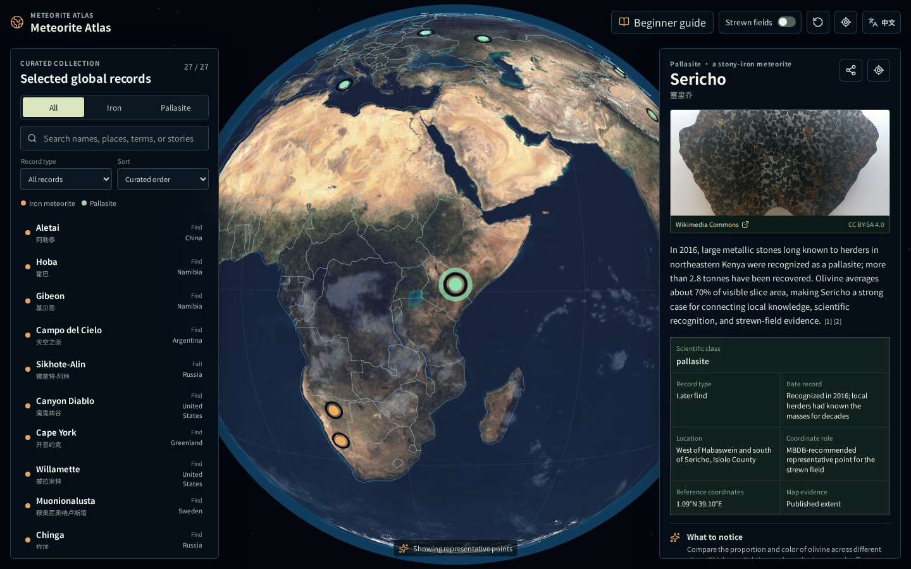

# Meteorite Atlas

**English** | [简体中文](README.zh-CN.md)

[Open the live atlas](https://seanwong17.github.io/meteorite-atlas/) · [Documentation](docs/README.md) · [Contributing](CONTRIBUTING.md)

A beginner-friendly, open-source learning atlas that connects iron meteorites and pallasites through an interactive globe, scientific classification, find or fall records, spatial evidence, and verified specimen images.



## Scope

This is a curated learning collection, not a complete global meteorite database. The current 27 official records focus on three introductory questions:

- How do iron meteorites and pallasites differ in structure?
- Why are an observed fall and a later find not the same kind of record?
- What evidence do a point, dashed line, or shaded extent represent on a map?

A pallasite is one type of stony-iron meteorite, not a synonym for every stony-iron meteorite. Official names, classifications, and reference coordinates prioritize the Meteoritical Bulletin Database (MBDB).

## Features

- Three.js globe with country boundaries, classification markers, and evidence-based strewn-field layers
- Chinese and English interface, editorial content, search vocabulary, and shareable `lang` URL state
- Search across names, aliases, regions, classifications, years, and educational terms
- Category and record-type filters with name and date sorting
- Beginner learning paths, glossary, observation prompts, and side-by-side comparison
- Shareable meteorite and filter URLs with browser back/forward support
- Desktop workspace plus exclusive map, catalog, and detail views on mobile
- Locally cached specimen images with manual subject review and item-level attribution
- JSON Schema, cross-file bilingual validation, CI, and Playwright end-to-end tests

The globe is stationary by default. It remains centered while users orbit in any geographic direction; selecting a record changes the viewing direction without shifting the control target. Auto-rotation is optional and stops on manual input.

## Run Locally

Node.js 18 or later is required.

```bash
npm ci
npm run dev
```

Useful commands:

```bash
npm run validate:data  # Validate data, translations, geometry, sources, and image records
npm run build          # Build the production site
npm run test:e2e       # Start the test server and run browser tests
npm run check          # Run the complete validation suite
npm run fetch:images   # Create Commons candidates that still require manual review
npm run cache:images   # Cache approved images and regenerate attribution documents
```

## Repository Layout

```text
data/                         Primary records, English content, image manifest, and JSON Schema
docs/                         Bilingual research, content, spatial, and asset documentation
public/assets/                Earth assets, boundaries, and reviewed local images
scripts/                      Data validation and image-curation tools
src/App.jsx                   UI state, catalog, details, guide, comparison, and i18n wiring
src/GlobeScene.jsx            Three.js scene and spatial representation
src/i18n.js                   Runtime interface and record localization
tests/atlas.spec.js           Critical workflows, responsive behavior, and WebGL checks
```

Before adding a record, read the [data contribution guide](docs/data-contribution.md), [content guide](docs/content-guide.md), and [spatial model](docs/spatial-model.md). See the [architecture overview](docs/architecture.md) for implementation boundaries.

## Data Principles

- Find locations, fall locations, strewn fields, impact craters, and museum locations remain distinct.
- Unknown boundaries are never replaced with arbitrary circles or administrative centers.
- Automated image search only produces `needs-review` candidates; only manually approved images can be published.
- Specific claims use paragraph-level references, with dedicated sources for history, mass, and spatial extents.
- Every curated record must have a complete English content counterpart and pass `npm run validate:data`.

## Contributing

Contributions that improve sources, language, accessibility, image review, or tests are welcome. Read [CONTRIBUTING.md](CONTRIBUTING.md) before opening a pull request. Beginner contributors can start with issues labeled `good first issue`.

## License

Code is released under the [MIT License](LICENSE). Original educational writing and data structure are available under CC BY 4.0. Wikimedia Commons images, Earth textures, and Natural Earth boundaries retain their individual terms; see [third-party licenses](docs/licenses.md).

## Current Collection

The atlas currently includes 13 iron meteorites and 14 pallasites. The newest curated addition is Kenya's Sericho pallasite, documented with its official MBDB reference point and a reported strewn field longer than 45 km without inventing an unsupported boundary.
