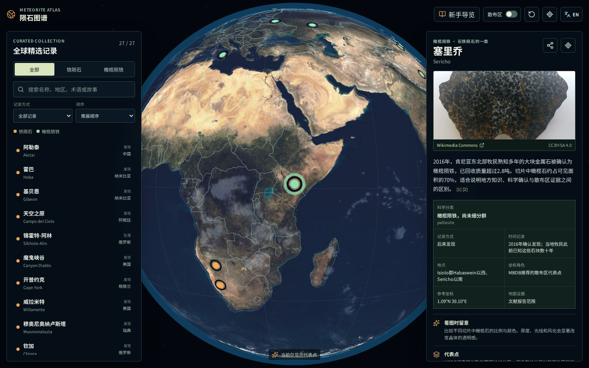

# 陨石图谱

[English](README.md) | **简体中文**

[在线访问陨石图谱](https://seanwong17.github.io/meteorite-atlas/) · [说明文档](docs/README.zh-CN.md) · [参与贡献](CONTRIBUTING.zh-CN.md)

面向初级爱好者的开源陨石学习图谱。项目用可交互地球仪串联铁陨石与橄榄陨铁的分类、发现或坠落记录、空间证据和经过核验的标本图片。



## 项目定位

这是一份精选学习图谱，不是全球陨石完整数据库。当前收录 27 个正式命名记录，重点回答三个入门问题：

- 铁陨石与橄榄陨铁在结构上有什么不同？
- “目击坠落”和“后来发现”为什么不能混为一谈？
- 地图上的点、虚线和范围分别代表什么证据？

橄榄陨铁是石铁陨石的一类，不等同于全部石铁陨石。正式名称、分类和参考坐标优先采用 Meteoritical Bulletin Database（MBDB）。

## 功能

- Three.js 可旋转地球仪、国家边界、分类标记和基于证据的散布范围图层
- 中英文界面、科普内容、搜索词汇和可分享的 `lang` URL 状态
- 名称、别名、地区、分类、年份和科普术语全文搜索
- 类别、记录方式筛选以及名称、年份排序
- 新手学习路线、术语表、观察提示和双记录对比
- 可分享的陨石与筛选 URL，支持浏览器前进后退
- 桌面工作区，移动端地图、目录、详情单面板导航
- 经过主题与许可证核验的本地图片缓存和逐项署名
- JSON Schema、跨文件双语校验、CI 和 Playwright 端到端测试

地球默认静止并始终保持在画面中心。用户可以沿任意地理方向环绕查看；选择记录只改变观察方向，不移动控制中心。自动旋转是可选功能，并会在用户手动操作后停止。

## 本地运行

需要 Node.js 18 或更高版本。

```bash
npm ci
npm run dev
```

常用命令：

```bash
npm run validate:data  # 校验数据、翻译、几何、来源和图片清单
npm run build          # 生成生产版本
npm run test:e2e       # 自动启动测试服务器并运行浏览器测试
npm run check          # 执行完整检查
npm run fetch:images   # 生成仍需人工审核的 Commons 候选
npm run cache:images   # 缓存批准图片并重新生成署名文档
```

## 数据与目录

```text
data/                         主数据、英文内容、图片清单和 JSON Schema
docs/                         中英双语研究、内容、空间和资源说明
public/assets/                地球、边界和核验后的本地图片
scripts/                      数据校验与图片策展工具
src/App.jsx                   页面状态、目录、详情、导览、对比和 i18n 接线
src/GlobeScene.jsx            Three.js 场景与空间表达
src/i18n.js                   运行时界面与记录本地化
tests/atlas.spec.js           关键流程、响应式和 WebGL 测试
```

新增记录前请阅读[数据贡献指南](docs/data-contribution.zh-CN.md)、[内容写作规范](docs/content-guide.zh-CN.md)和[空间表达规则](docs/spatial-model.zh-CN.md)。实现概览见[架构说明](docs/architecture.zh-CN.md)。

## 数据原则

- “发现地”“坠落地点”“散布区”“撞击坑”和“展藏地点”分别记录。
- 不用任意圆或行政中心伪装未知边界。
- 自动图片搜索只产生 `needs-review` 候选，人工核验后才能发布。
- 页面摘要使用段落级来源编号；历史、质量和空间范围等陈述应补充专门来源。
- 每个精选记录必须有完整英文内容并通过 `npm run validate:data`。

## 参与贡献

欢迎补充来源、改善语言、核验图片、提升无障碍或增加测试。提交前请阅读 [CONTRIBUTING.zh-CN.md](CONTRIBUTING.zh-CN.md)。适合第一次参与的任务可以从带有 `good first issue` 标签的 Issue 开始。

## 许可证

代码采用 [MIT License](LICENSE)。项目原创科普文字与数据结构采用 CC BY 4.0；Wikimedia Commons 图片、地球贴图和 Natural Earth 边界保持各自许可。详见[许可证与第三方资源](docs/licenses.zh-CN.md)。

## 当前范围

当前版本包含 13 个铁陨石和 14 个橄榄陨铁记录。最新补充的是肯尼亚塞里乔橄榄陨铁：地图采用 MBDB 正式参考点，并说明超过 45 公里的报告散布带，不臆造缺乏依据的边界。
